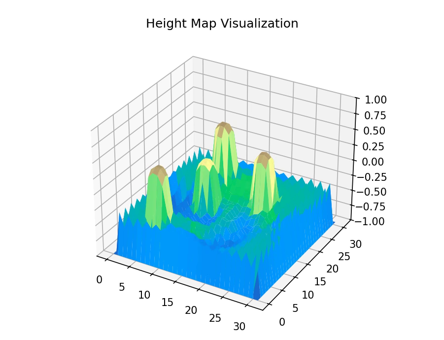
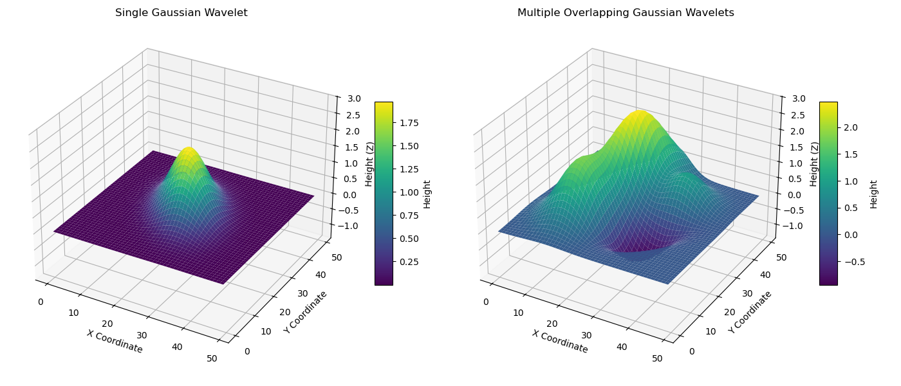
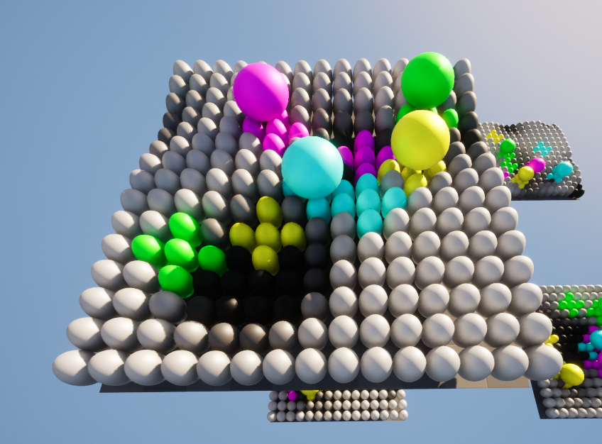
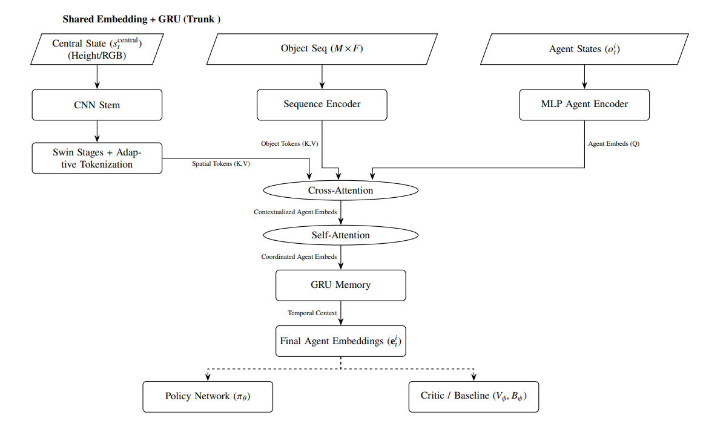
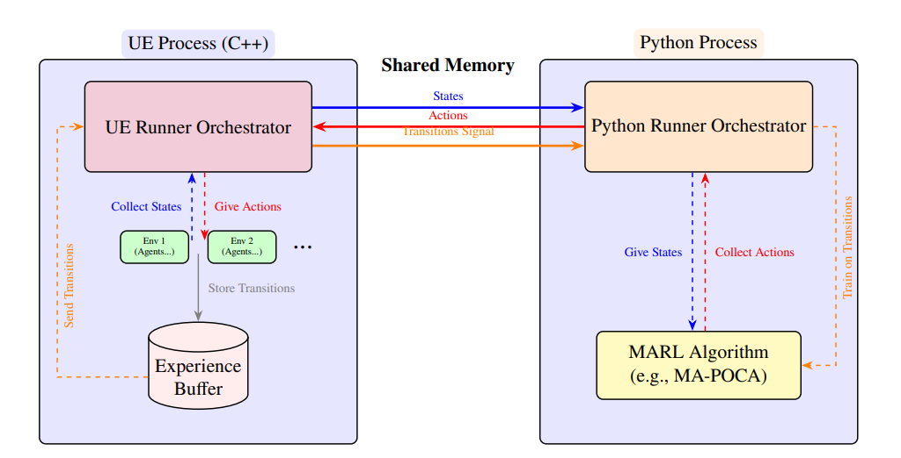
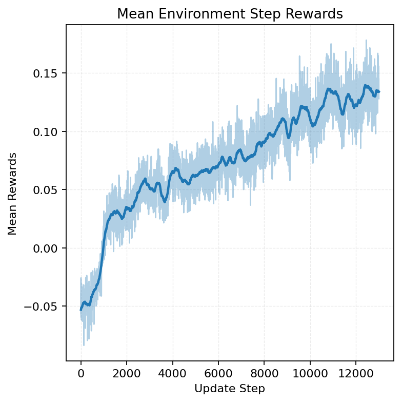
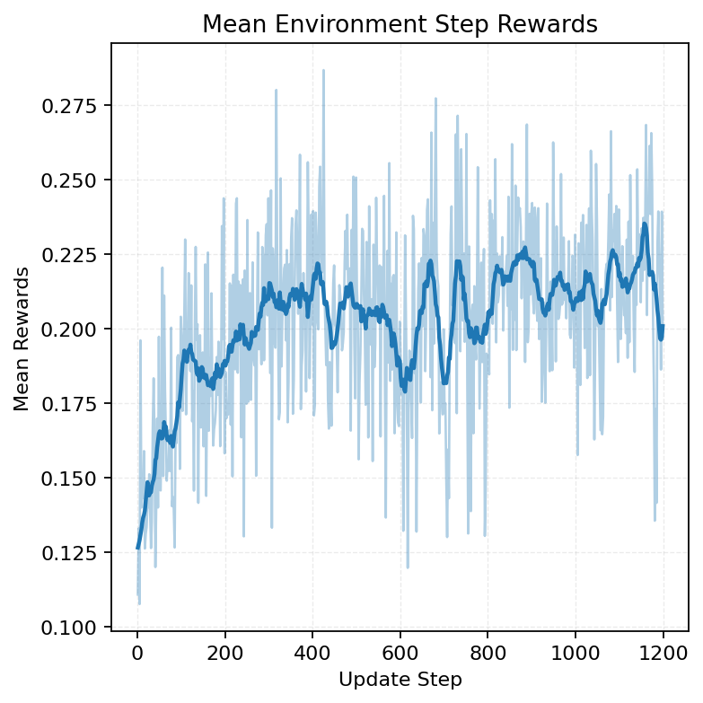
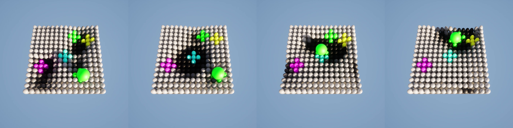

# UnrealRLLabs & TerraShift

## Project Overview
UnrealRLLabs is a UE 5.6 experimentation framework built to run many reinforcement-learning environments in lockstep inside the engine while an external Python trainer optimizes policies. The project packages multi-environment orchestration (`RLRunner`), shared-memory interprocess communication, and config-driven rollouts so that researchers can iterate on agents without touching the Unreal side of the loop.

TerraShift is the flagship environment showcased in the capstone report. It models a dense array of actuated columns whose height field can be reshaped in real time by cooperating agents. Each agent owns a Gaussian wavelet that sculpts the surface, and together the team routes color-coded objects into matching goal regions. By pairing TerraShift with UnrealRLLabs' synchronized data collection and Python-based PPO/MA-POCA training stack, the repository serves as a reproducible benchmark for cooperative terrain control and the basis for the accompanying research analysis.

On the modeling side, the project contributes a multi-stream, attention-based policy architecture that fuses CNN-derived height patches, object descriptors, and agent context into shared embeddings before temporal processing with a GRU. Separate policy, value, and counterfactual-baseline heads support MA-POCA-style credit assignment across agents, enabling coordinated surface shaping. Together, the framework (engine integration), benchmark (TerraShift), and modeling stack (multi-agent PPO with transformer-style perception) form the three pillars described in the capstone paper.

## UnrealRLLabs Highlights
- Classic MDP formulation: UnrealRLLabs aligns the engine tick with a clean step interface that captures `(state, action, reward, next_state, done)` tuples, while `Source/Mecanum_Robot_RL/Public/BaseEnvironment.h` and `Source/Mecanum_Robot_RL/Public/ActionSpace.h` define the hooks for describing observation and action spaces so custom UE environments plug directly into standard RL pipelines.
- Parallel rollouts: `Source/Mecanum_Robot_RL/Private/RLRunner.cpp` launches synchronized environment instances, batches observations, and streams them through shared memory (`Source/Mecanum_Robot_RL/Private/SharedMemoryAgentCommunicator.cpp`) so the external learner can train against high-throughput step buffers.
- Config-driven: JSON experiment configs select environment classes, buffer sizes, and other behaviors without recompiling UE code, keeping iteration tight from the Python training scripts.
- Shared-process architecture: the Unreal runner, Python runner, shared-memory bridge, experience buffer, and MARL algorithm communicate exactly as shown in `Report/Images/UnrealRLLabs DataFlow Archetecture.png`.


## TerraShift Environment Highlights
- Cooperative terrain control: `Source/Mecanum_Robot_RL/Private/TerraShiftEnvironment.cpp` builds a columnar height field, scatters colored objects/goals, and tasks the team with reshaping the terrain to sort each ball into its goal. `Report/Images/env_screenshot.png` captures a live TerraShift instance inside UE, showing the actuated columns, objects, and goal regions rendered during training or evaluation.
- Gaussian wavelet actuation: `Source/Mecanum_Robot_RL/Private/TerraShift/MultiAgentGaussianWaveHeightMap.cpp` lets every agent modulate a localized wave (position, velocity, amplitude, sigmas, angular velocity) whose superposition steers objects; `Report/Images/gaussian_waves.png` illustrates the concept of blended surface.
- Rich observability and rewards: `Source/Mecanum_Robot_RL/Private/TerraShift/StateManager.cpp` exports height maps, object/agent sequences, and optional camera frames (see `Report/Images/central_state_figure.png`) while reward toggles add goal bonuses, potential shaping, velocity alignment, and penalties.







## Python Training Stack
- Shared-memory handshake: `Content/Python/Source/Environment.py` mirrors the engine-side communicator, mapping buffers/events into tensors so the Python runner can pull trajectories and push joint actions each tick.
- Runner orchestration: `Content/Python/Source/Runner.py` manages trajectory segments, GRU hidden state, normalization (RunningMeanStd, PopArt), checkpoint cadence, and evaluation passes while coordinating with the experience buffer shown in the data-flow diagram.
- MAPOCA agent: `Content/Python/Agents/MAPOCAAgent.py` implements PPO with MA-POCA counterfactual baselines plus optional RND and disagreement intrinsic rewards. `Content/Python/Source/Networks.py` houses the shared embedding trunk that fuses height-map patches, object features, and agent tokens via cross-attention before policy/value/baseline heads; the architecture overview is depicted in `Report/Images/Network Archetecture Overview.png`.
- End-to-end loop: each UE step yields `(state, reward, done)` tuples, Python infers actions, and updates occur after batched rollouts-faithful to the high-level flow in `Report/Images/UnrealRLLabs DataFlow Archetecture.png`.





## Quickstart
- **Install the Unreal toolchain**: Download the [Epic Games Launcher](https://store.epicgames.com), install [Visual Studio 2022](https://visualstudio.microsoft.com/vs/) with the Desktop/Game development workloads and Windows 11 SDK, then add Unreal Engine **5.6.1** through the launcher.
- **Provision the Python workspace**: Install [Miniconda](https://docs.conda.io/en/latest/miniconda.html) or [Anaconda](https://www.anaconda.com/download). From `Content/Python`, run:
  ```bash
  cd Content/Python
  conda env create -n terrashift -f environment.yml
  conda activate terrashift
  ```
  Pip users can mirror the same dependencies (PyTorch 2.5.1 + CUDA 11.8 wheels, torchvision, torchaudio, numpy, scipy, tensorboard, tqdm, psutil) on Python 3.11.
- **Install CUDA (optional)**: Update NVIDIA drivers and install [CUDA Toolkit 11.8](https://developer.nvidia.com/cuda-11-8-0-download-archive) so PyTorch can use the GPU; CPU-only execution works but is slower.
- **Generate UE project files**: Right-click `UnrealRLLabs.uproject`, choose *Switch Unreal Engine Version...*, target UE 5.6.1, and open `UnrealRLLabs.sln` in Visual Studio. Build or launch via *Local Windows Debugger* to confirm `Content/RL_Level.umap` opens before moving on to the training workflow.

## Training & Evaluation Workflow
- **Start a session**: With `RL_Level` playing in the UE editor (PIE or Standalone), activate the `terrashift` environment and launch the trainer from `Content/Python`:
  ```bash
  conda activate terrashift
  cd Content/Python
  python Train.py --config Configs/TerraShift.json --resume_from_checkpoint ""
  ```
  The console prints when the shared-memory handshake completes and rollouts begin.
- **Resume or branch experiments**: Point `--resume_from_checkpoint` at any file inside `Content/Python/checkpoints/` to continue training. Use baseline configs such as `Configs/TerraShift_PreTrain_8Agents_15Grid.json` for pretraining, then switch to larger-grid configs while keeping the same checkpoint flag to reproduce finetuning stages.
- **Monitor metrics**: Logs write to `Content/Python/runs/`. From the `Content/Python/` directory, launch TensorBoard with `tensorboard --logdir runs --host localhost --port 8888` for live curves, and watch the UE Output Log for environment warnings and other helpfull messages.
- **Automated evaluation**: Enable the config's `test` block (e.g. `"test": {"enabled": true, "frequency": 10, "steps": 2048}`) to schedule evaluation-only rollouts, or set `"eval_only": true` for inference sessions that leave weights untouched but still record metrics.
- **Debugging and data capture**: Toggle the `StateRecorder` section to dump trajectory visualizations into `Content/Python/recordings/`.

## Research Artifacts
- **Capstone report**: `Report/TerraShift Report.pdf` documents the motivation, system design, and experimental campaign. It frames TerraShift as a cooperative terrain-control benchmark, details the UnrealRLLabs infrastructure, and explains MARL algorithm.
- **Pretrain -> finetune regime**: Training begins on an 8-agent, 15x15 grid curriculum (`Content/Python/Configs/TerraShift_PreTrain_8Agents_15Grid.json`) for roughly 96M environment steps, then resumes from the saved checkpoint in `Content/Python/checkpoints/` to scale up to the 16-agent, 30x30 task (`Content/Python/Configs/TerraShift_Finetune_16Agents_30Grid.json`). Learning curves (`Report/Results/reward_mean_pretrain.png`, `Report/Results/reward_mean_finetune.png`) show sustained improvement and rapid reacquisition after transfer.
- **Emergent behaviors**: Qualitative analysis highlights coordinated basin formation, cluster breaking, and ball-to-ball avoidance. `Report/Results/behavior_basin.png` captures one such emergent pattern where agents sculpt a shared basin that shuttles an object to its goal.
- **Reproducibility assets**: Checkpoints in `Content/Python/checkpoints/` pair with their respective configs so readers can replay the behaviors in-editor or continue training to explore alternate reward schedules or curriculum stages.







## AI Disclosure
Portions of this codebase were drafted with assistance from AI tools (OpenAI ChatGPT, Google Gemini, Microsoft Copilot).

All AI-generated content was reviewed, edited, and tested by Zach Oines to ensure accuracy and compliance with University of Minnesota academic standards.
